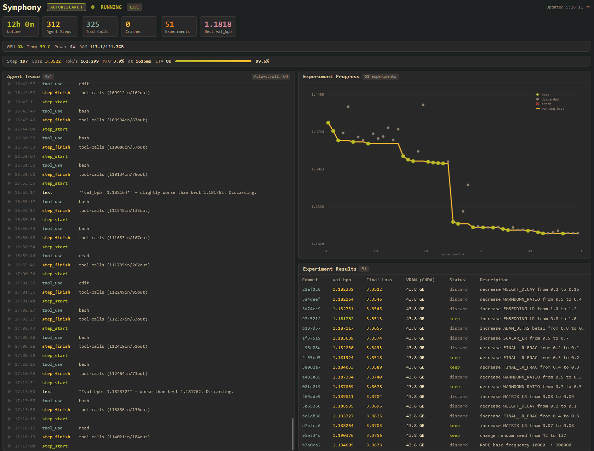

# Symphonic Autoresearch

Production infrastructure for autonomous ML research. Wraps [Karpathy's autoresearch](https://github.com/karpathy/autoresearch) with crash recovery, a real-time web dashboard, optional persistent memory, and one-command Docker deployment.

## What This Does

An AI coding agent gets access to a small LLM training setup and runs experiments continuously:

1. Modifies `train.py` with an experimental change
2. Trains for 5 minutes (fixed time budget)
3. Evaluates validation loss (`val_bpb`)
4. Keeps or reverts based on results
5. Repeats forever

The orchestrator handles everything around that loop: restarting after crashes, injecting context so the agent doesn't repeat itself, streaming progress to a dashboard you can check from your phone, and optionally persisting research knowledge across sessions.

## Live Results

Currently running on an NVIDIA DGX Spark (Grace Blackwell, 128 GB unified memory). Here's how the numbers compare to Karpathy's original H100 run:

| | Karpathy's Run (H100) | Symphonic (DGX Spark) |
|---|---|---|
| Experiments | 126 | 52 |
| Kept improvements | 23 | 22 |
| Crashes | not reported | 1 (recovered) |
| Baseline val_bpb | 0.9979 | 1.3944 |
| Best val_bpb | 0.9697 | 1.1818 |
| Improvement | 2.8% | 15.3% |

The baselines aren't directly comparable (different hardware, different starting points). Karpathy started from hand-tuned code on an H100 with 989 TFLOPS bf16. The Spark baseline was a cold start with SDPA attention. See the [blog post](./BLOG_POST_FINAL.md) for a detailed breakdown.

The agent is still running. These numbers will be different by the time you read this.

## How This Differs From Karpathy's Original

| Feature | Karpathy's Autoresearch | Symphonic Autoresearch |
|---------|------------------------|------------------------|
| Core loop | Identical | Identical |
| Training code | ~600 lines Python | Same (imported) |
| Orchestration | None (agent runs directly) | TypeScript orchestrator with crash recovery |
| Visibility | Terminal output only | Real-time web dashboard with SSE |
| Hardware monitoring | None | GPU temp, power, utilization, memory |
| Crash recovery | Agent exits on error | Auto-restart with exponential backoff + context injection |
| Cross-session memory | None | Optional vector store (requires embedding server) |
| User guidance | Kill and restart with new prompt | Async instruction injection via dashboard |
| Deployment | `uv run` manually | `docker compose up` |
| Configuration | Edit files directly | YAML frontmatter, hot-reloadable |
| Overhead | Zero | ~100MB RAM for Node.js process |

**When to use Karpathy's**: You want to understand how it works. You're experimenting for an afternoon. You value simplicity above all else.

**When to use Symphonic**: You're leaving it running overnight or longer. You want visibility from anywhere. You care about crash recovery. You have the infrastructure (or patience) for optional features like knowledge persistence.

## Quick Start

### Prerequisites

1. **NVIDIA GPU** with CUDA support (compute capability 8.0+ for Flash Attention 3). Tested on DGX Spark (GB10, compute 12.0).

2. **Docker** with NVIDIA Container Toolkit:
   ```bash
   # Verify NVIDIA Docker runtime works
   docker run --rm --gpus all nvidia/cuda:12-base nvidia-smi
   ```

3. **OpenCode CLI**:
   ```bash
   # Install OpenCode following instructions at opencode.ai
   mkdir -p ~/.opencode/bin
   # ... install steps per platform

   # Verify installation
   ~/.opencode/bin/opencode --version
   ```

   The Docker container mounts `~/.opencode` and expects the binary at this location.

4. **OpenCode configuration**:
   ```bash
   # Required: provider definitions for your model(s)
   ~/.config/opencode/opencode.json

   # Optional: agent rules and instructions
   ~/.config/opencode/AGENTS.md
   ```

   See `example.WORKFLOW.md` for how to configure the model in WORKFLOW.md.

### Setup

```bash
git clone https://github.com/IMJONEZZ/symphonic-autoresearch.git
cd symphonic-autoresearch

cp example.WORKFLOW.md WORKFLOW.md
# Edit WORKFLOW.md with your model and preferences

docker compose up --build
```

### Access the Dashboard

Open http://your-server:8080 to see:
- Live training progress (loss, tok/s, MFU, VRAM)
- Experiment history from `results.tsv`
- GPU metrics (temperature, utilization, power draw)
- Agent trace with expandable JSON events
- Instruction input for async human guidance



## Configuration

All settings live in `WORKFLOW.md`:

```yaml
---
mode: autoresearch

workspace:
  root: ~/symphonic-autoresearch-workspaces

opencode:
  command: opencode
  model: your-model-here

autoresearch:
  program_md: ./autoresearch/program.md
  prepare_py: ./autoresearch/prepare.py
  train_py: ./autoresearch/train.py
  restart_on_crash: true
  max_crash_restarts: 20
  knowledge_enabled: false

server:
  port: 8080
---
```

See `example.WORKFLOW.md` for all available options.

## Project Structure

```
symphonic-autoresearch/
├── src/
│   ├── orchestrator/      # Main loop, state management, retry logic
│   ├── agent/             # OpenCode client wrapper, prompt building
│   ├── server/            # HTTP + SSE dashboard server
│   ├── workspace/         # Git workspace management
│   ├── monitor/           # Hardware metrics (GPU)
│   ├── knowledge/         # Optional vector store for memory
│   ├── config/            # YAML parsing, validation
│   ├── prompt/            # Liquid template rendering
│   ├── logging/           # Pino structured logging
│   ├── tracker/           # Linear issue tracking integration
│   ├── utils/             # Path, env, sanitization helpers
│   └── types/             # TypeScript definitions
├── autoresearch/
│   ├── prepare.py         # Data download, tokenizer (from Karpathy)
│   ├── train.py           # Model + training loop (agent modifies this)
│   └── program.md         # Agent instructions
├── WORKFLOW.md            # Your configuration (gitignored)
├── example.WORKFLOW.md    # Configuration template
└── docker-compose.yml     # One-command deployment
```

37 TypeScript files. ~5,100 lines of orchestration code.

## License

See [LICENSE](./LICENSE) for details. Free to use; revenue sharing applies for commercial deployments or replication.

## Credits

Built on top of [Karpathy's autoresearch](https://github.com/karpathy/autoresearch). The core training loop and model architecture are his work. This project adds production infrastructure around it.
